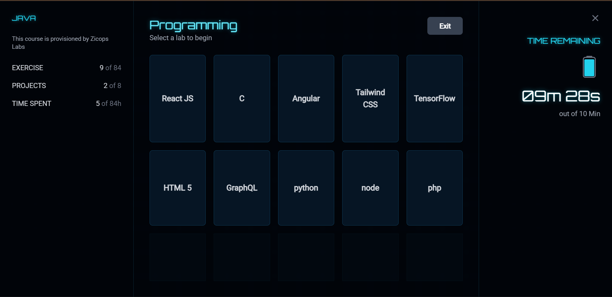

# Internal Lab Access Portal - Frontend Technical Task

This repository contains the submission for a frontend developer technical task. It is a single-page application built with **React** that simulates a secure, time-limited entry portal for an internal lab dashboard. The project is designed to run from a single `index.html` file without any build steps.

---

## Demo Video

This short video demonstrates the application's core functionality, including the login process, the lab dashboard, the session timer, and the exit flow.

---

## Screenshots

Here are two key screens from the application: the initial login portal and the internal lab dashboard.

| Login Screen | Lab Dashboard |
| :---: | :---: |
|  |  |

---

## Features ✨

-   **Persistent UI Shell:** A stable three-column layout where the side panels for stats and the timer are always visible.
-   **Dynamic Content Area:** The central part of the screen dynamically switches between the login modal and the lab dashboard.
-   **Password Authentication:** Access is protected by a hardcoded password, with clear error messages for incorrect attempts.
-   **Session Timer:** Users are allocated a 60-minute session. The timer starts on login, pauses on exit, and resumes upon re-entry.
-   **Automatic Logout:** The session automatically terminates and returns to the login screen when the timer expires.
-   **State Preservation:** Remaining session time is preserved when a user exits and logs back in.

---

## Technical Stack 🛠️

-   **React JS:** The application is built using React for its component-based architecture and efficient state management with Hooks.
-   **Tailwind CSS:** All styling is handled with Tailwind CSS for a modern, utility-first approach.
-   **Babel (Standalone):** Transpiles JSX in the browser, enabling the entire application to be self-contained in one `index.html` file.
-   **Google Fonts:** Uses the "Orbitron" and "Roboto" fonts to achieve the specified high-tech aesthetic.

---

## How to Run the Application 🚀

This project is designed for simplicity and requires no installation or build commands.

1.  **Clone the repository** or download the files.
2.  **Open `index.html`** directly in any modern web browser (like Chrome, Firefox, or Edge).

The application will start immediately.

-   **Password:** `1234`
